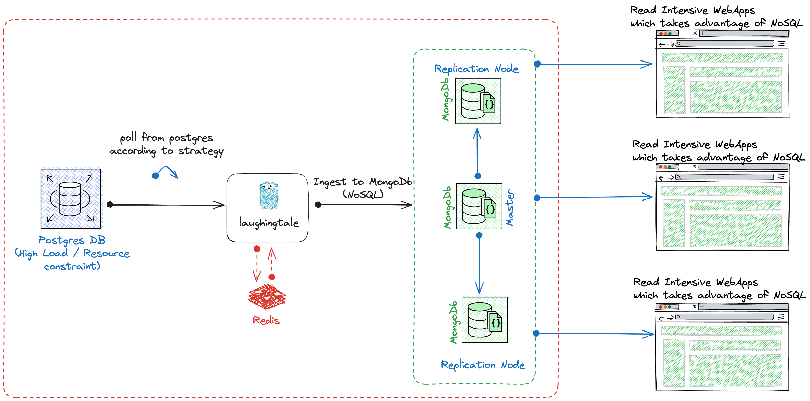

# laughingtale

A container based cache for your fat database with NoSQL powers.




## Introduction
This project is designed to efficiently poll data from PostgreSQL and ingest it into MongoDB using GoLang. It utilizes a JSON configuration file to define the data sources, target collections, database schemas, polling strategies, and other configurations necessary for the data ingestion process.

## Configuration

You can configure the polling and ingestion strategies using the following API.

```sh
curl 'localhost:8080/api/v1/loaderSourceConfig' \
--header 'Content-Type: application/json' \
--data '{
    "identifier": "breaksignal_research",
    "sourceConfig": [
        {
            "version": "1",
            "targetCollectionName": "research",
            "dbSchema": "papers",
            "tableName": "bsg_research",
            "primaryKey": "id",
            "primaryKeyType": "string",
            "columnList": [],
            "filterConfig": {
                "whereQuery": "updated_at >= NOW() - INTERVAL '\''90 days'\''",
                "limit": "10000"
            },
            "pollerConfig": {
                "pollingStrategy": "SIMPLE_INCREMENTAL",
                "deltaUpdateIntervalInMinutes": "2"
            }
        },
        {
            "version": "1",
            "targetCollectionName": "address",
            "dbSchema": "contact",
            "tableName": "address",
            "primaryKey": "id",
            "primaryKeyType": "int64",
            "columnList": [],
            "filterConfig": {
                "whereQuery": "updated_at >= NOW() - INTERVAL '\''90 days'\''",
                "limit": "10000"
            },
            "pollerConfig": {
                "pollingStrategy": "SIMPLE_INCREMENTAL",
                "deltaUpdateIntervalInMinutes": "2"
            }
        },
        {
            "version": "1",
            "targetCollectionName": "presenter",
            "dbSchema": "user",
            "tableName": "paper_presenter",
            "primaryKey": "id",
            "primaryKeyType": "string",
            "columnList": [],
            "filterConfig": {
                "whereQuery": "updated_at >= NOW() - INTERVAL '\''90 days'\''",
                "limit": "10000"
            },
            "pollerConfig": {
                "pollingStrategy": "SIMPLE_INCREMENTAL",
                "deltaUpdateIntervalInMinutes": "2"
            }
        }
    ],
    "type": "loader"
}'
``` 

## Features

1. Flexible Configuration: The project allows users to define multiple data sources with custom filter configurations and polling strategies. Users can specify the target collection, database schema, primary key, and other essential details for each data source.

2. Efficient Data Polling: Supports different polling strategies such as `SIMPLE` and `SIMPLE_INCREMENTAL` (Polls only incremental data after an initial full data load, reducing redundant queries and improving performance).

3. Real-time Data Ingestion: By specifying delta update intervals, the project ensures timely ingestion of new or updated data into MongoDB. Enables real-time analytics and reporting by keeping MongoDB collections up-to-date with the latest data from PostgreSQL.

## Usage

1. Clone the repository and navigate to the project directory.
2. go build
3. ./laughingtale

After running you can use the above mentioned curl to configure the datasources.

## Dependencies

- GoLang
- PostgreSQL
- MongoDB